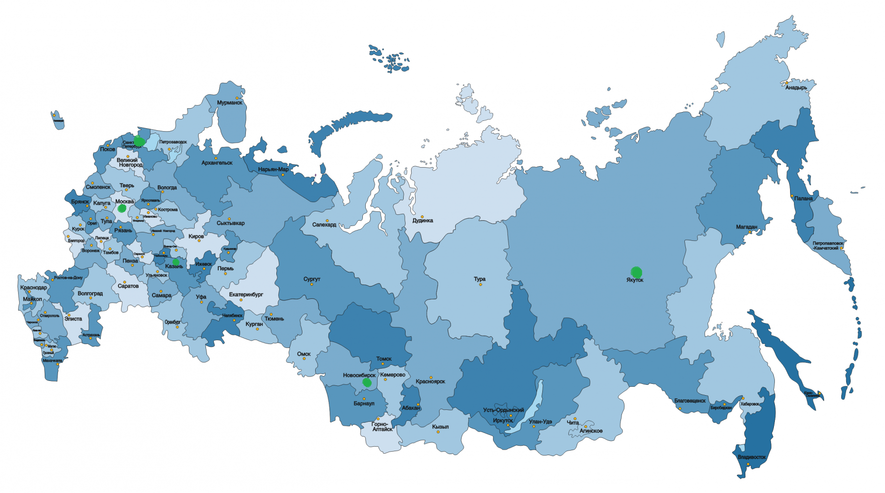
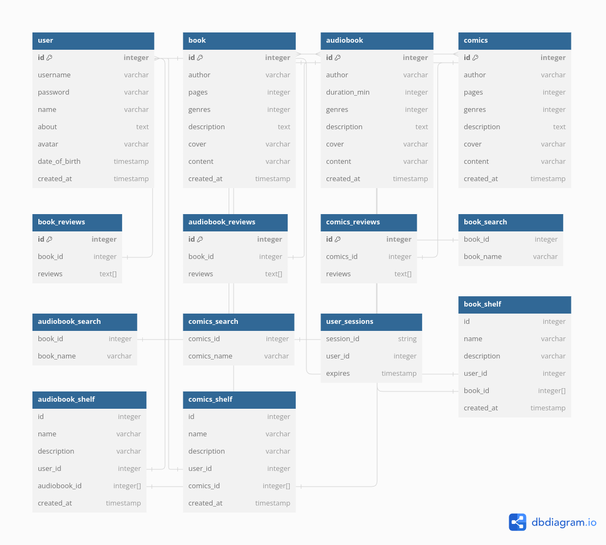
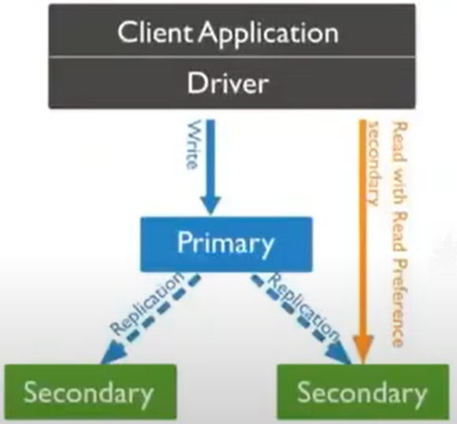
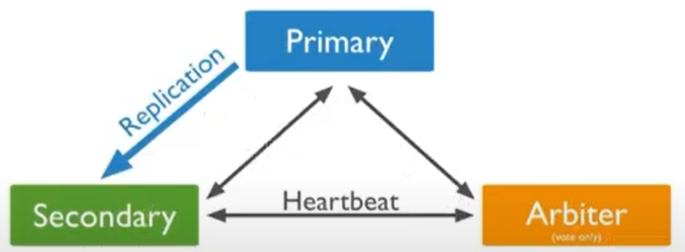
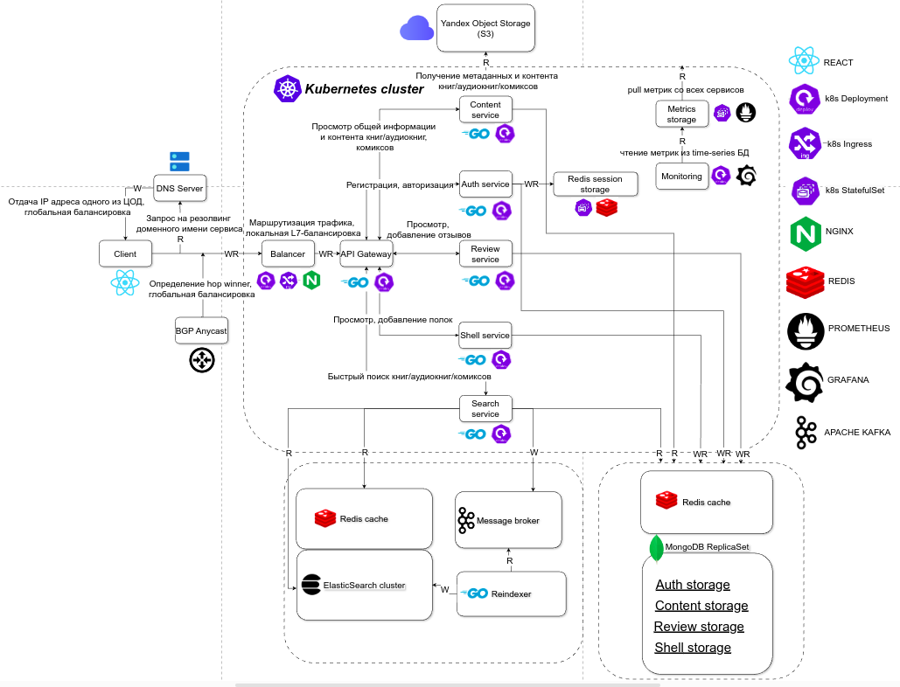

# Проектирование платформы "Букмейт" - сервиса для чтения и прослушивания книг

## Содержание

- ### [Тема и целевая аудитория](#1_part)
- ### [Расчет нагрузки](#2_part)
- ### [Глобальная балансировка нагрузки](#3_part)
- ### [Локальная балансировка нагрузки](#4_part)
- ### [Логическая схема БД](#5_part)
- ### [Физическая схема БД](#6_part)
- ### [Технологии](#7_part)
- ### [Схема проекта](#8_part)
- ### [Обеспечение надежности](#9_part)
- ### [Расчет ресурсов](#10_part)
- ### [Источники](#sources)

## 1. Тема и целевая аудитория 

- Область присутствия - Россия
- Аналитика по возрастным группам

- Распределение пользователей по полу:
    - Женщины - 49.91%
    - Мужчины - 50.09%

### Функционал

- Регистрация
- Чтение книг/комиксов
- Прослушивание аудиокниг
- Полки
- Отзывы на книги/аудиокниги/комиксы
- Поиск

## 2. Расчет нагрузки 

### Продуктовые метрики

- [Согласно представленной информации](https://www.similarweb.com/website/bookmate.ru/#demographics), значение ***MAO*** составляет ***4.3 млн. пользователей***
- По размеру дневной аудитории не удалось найти информацию в открытых источниках, потому определим показатель ***DAO***, исходя из приблизительных вычислений:
    - Т.к. небольшой процент людей читает на каждодневной основе, возьмем приближенный коэффициент ***~0.3*** от числа уникальных пользователей в месяц, получаем
      
    > 0.3*4.3 = 1.29 млн. пользователей в сутки

- Интенсивность использования разных функций:
    1. Чтение книг:
        - Опорная метрика - ***среднее количество страниц, читаемых пользователем в день***. По причине отсутствия этой и подобных метрик примем значение с некоторой погрешностью: ***3.8 страниц в день***
    2. Прослушивание аудиокниг:
        - Примем следующее значение: ***1.2 мин. в день***
    3. Просмотр комиксов:
        - Примем следующее значение: ***0.001 страницы в день***
    4. Написание отзывов:
        - Примем следующее значение: ***0.0002 отзыва в день***
    5. Использование поиска:
        - Примем следующее значение: ***0.8 запроса в день***

| Действие | Ср. значение метрики |
| --- | --- |
| Чтение страниц | 3.8 [шт.] |
| Прослушивание аудиокниги | 1.2 [мин.] |
| Чтение комиксов | 0.001 [шт.] |
| Написание отзыва | 0.0002 [шт.] |
| Поисковый запрос | 0.8 [шт.] |
- Объем данных пользователя:
    - ***Данные аккаунта*** - ~25Кб (размер аватарки с учетом сжатия - ~20Кб, размер прочих текстовых данных - ~5 Кб)

## Технические метрики

### Размер хранения

### 1. Аудио

- [Согласно актуальным источникам](https://www.forbes.ru/forbeslife/482707-andeks-zapustil-servis-elektronnyh-i-audioknig-bukmejt-dla-pol-zovatelej-plusa), в книжном сервисе есть доступ к 170 тыс. аудиокнигам. [Средняя продолжительность аудиокниги составляет 10 часов](https://wordsrated.com/audiobook-statistics/#:~:text=Generally%2C%20around%209%2C300%20words%20of,containing%20close%20to%20100%2C000%20words.), то есть нужно хранить:
    
    > 320 * 60 = 19200 кбит/мин - размер 1-ой минуты аудио
    > 
    
    > ((((19200 * 1000) * 60) * 10) * 170.000) / 8 = 0.244 Пбайт
    > 
    

### 2. Книги

- [Средний размер цифровой книги - ~1-3 Мбайт](https://blog.rt.ru/b2c/elektronnaya-kniga-na-chto-obratit-vnimanie-pri-pokupke.htm?ysclid=lt2ziifd6h589690657), округлим в большую сторону, тогда для хранения книг необходимо хранилище размером:
    
    > 3 * 1.000.000 * 1.000.000 = 3000 Тбайт
    > 
- [Каталог комиксов не столь обширен](https://mel.fm/novosti/4597213-v-bukmeyte-poyavilsya-razdel-s-komiksami), их в расчет не берем.

### Трафик

### 1. Аудио

- Суммарный суточный трафик составит:
    
    > (19200 кбит/мин * 1000/8)* 1.2 мин/день * 1.29 млн. пользователей/день = 3715 Тбайт/сутки
    > 
- То есть на протяжении суток в среднем получаем следующий трафик по аудио:
    
    > 3715 / 86400 = 43 Мбайт/с
    > 

### 2. Книги

- Суммарный суточный трафик составит:
    - Примем средний размер страницы текста ~ 5 Кбайт
    
    > 1.29 * 1.000.000 * 3.8 * 5000 / 86400 = 24.7 Тбайт/сутки
    > 
- То есть на протяжении суток в среднем получаем следующий трафик по аудио:
    
    > 24.7 / 86400 = 286 Кбайт/с
    > 

### RPS в разбивке по типам запросов

- 3.8 страниц, читаемых в день в переводе на запросы с пагинацией - 4 запроса, тогда:
    
    > 4 запроса  * 1.29 млн. пользователей / 86400 = 60 RPS
    > 
- Положим, сервис отдает аудио чанками размера 8 Кбайт, тогда:
    
    > (320 кбит/c * 60) * 1.2 мин/день * 1.29 млн. пользователей / 86400 = 335 RPS
    > 
- Поисковые запросы:
    
    > 0.8шт * 1.29 млн. пользователей / 86400 = 11 RPS
    > 
- Для комиксов 1 страница - 1 запрос:
    
    > 0.001шт * 1.29 млн. пользователей  / 86400
    > 
- Каждый пользователь, заходящий в течение дня, с высокой долей вероятности зайдет в раздел полок для выбора контента. Пользователь также добавляет новые книги/аудиокниги/комиксы на свои полки, пусть и не столь часто, но это дополнительная нагрузки на запись, следовательно, утверждаем среднее количество запросов за полками - 2 запроса на человека в день.
    
    > 2 запроса * 1.29 млн. пользователей / 86400 = 30 RPS
    > 
- Отзывы пишутся относительно нечасто, однако чаще читаются, поэтому возьмем средний показатель по количеству запросов на чтение/запись отзывов на ежедневного посетителя - 1 запрос
    
    > 1 запрос * 1.29 млн. пользователей / 86400 = 15 RPS
    > 
- Регистрация - относительно нечастый кейс, как и авторизация - в случае последней будет выдана сессия, живущая 1 месяц и дальнейшие запросы, требующие авторизации(в основном это операции создания/редактирования полок, отзывов), будут валидироваться менеджером сессий. С учетом регистрации/авторизации + валидации сессий получаем:
    
    > 5 запросов * 1.29 млн. пользователей/ 86400 = 74 RPS
    >
    
    | Действие | RPS |
    | --- | --- |
    | Запрос страницы | 60 |
    | Запрос фрагмента аудио | 335 |
    | Поисковый запрос | 11 |
    | Запрос на создание/просмотр/редактирование полок | 30 |
    | Запрос на создание/просмотр/редактирование отзывов | 15 |
    | Регистрация/авторизация | 74 |

---

## 3. Глобальная балансировка нагрузки 

**Расположение датацентров**

[Целевая аудитория сервиса расположена преимущественно в России](https://www.similarweb.com/ru/website/livelib.ru/#traffic), значит все ДЦ целесообразно располагать на территории РФ.

Основное количество ДЦ расположим в европейской части страны, поскольку большая часть трафика приходится именно на ее регионы. Однако необходимо учесть и процент пользователей из Сибири, Дальнего Востока, [поскольку в данных регионах также высока доля активных интернет-пользователей.](https://finexpertiza.ru/press-service/researches/2022/kolich-inter-polz-vyrosl/)

Необходимо разместить ДЦ в нескольких городах федерального значения, таких как Москва и Санкт-Петербург, поскольку процент пользователей сервиса в данных городах наибольший, к тому же необходимо физически близкое расположение ДЦ к основным офисам для скорейшей отладки в самом ДЦ в случае неисправностей, устранимых только вручную инженерами непосредственно в ДЦ. 

***Предварительный список городов для расположения ДЦ:***

- Москва - покрытие МО и ближайших областей
- Санкт-Петербург - покрытие ЛО и ближайших областей
- Казань - Европейская часть России
- Новосибирск - Западная Сибирь
- Якутск - Дальний Восток

Чтобы убедиться, что схема расположения ДЦ выбрана правильно, оценим RTT из краевых точек до выбранных городов:

- Краснодар → Казань - 42.98 мс
- Мурманск → Санкт-Петербург - 68.52 мс
- Владивосток → Якутск - 49.90 мс
- Петропавловск-Камчатский → Якутск - 62.32 мс
- Норильск → Новосибирск - 72.55 мс

Поскольку значение RTT находится в допустимых пределах([100 мс](https://edgecenter.ru/blog/what-latency-is-and-how-to-reduce-it)), утверждаем выбранный список городов.

**Схема глобальной балансировки**

1. ***DNS балансировка*** - равномерное распределение нагрузки между ДЦ
2. ***Anycast балансировка -*** маршрутизация трафика клиента в ДЦ с меньшим весом в BGP таблице  

## 4. Локальная балансировка нагрузки 

В рамках ДЦ будем балансировать нагрузку на программном уровне с помощью ***L7-балансировщика***.

Аргументы в пользу L7-балансировщика в сравнении с L4-балансировщиком:

- Продвинутые возможности мониторинга как самого балансера, так и бэкендов
- Высокая гибкость конфигурации
- Существенно больше возможностей маршрутизации - content-based, URL-based маршрутизация. Как следствие, более продвинутые механизмы сохранения сессии(session persistence)
- Продвинутая балансировка с timeout policy, retry policy и другим функционалом
- Кеширование статики и динамического контента, буферизация ответов для медленных клиентов
- Возможность производить TLS-прерывание - разгрузка бэкендов, проверка шифров, требуемых политик безопасности и т.д.
- Модульность и расширяемость - возможность добавить собственный функционал в будущем

Несмотря на то, что балансировка на уровне L7 более затратна по CPU в сравнении с L4, оверхед не столь существенный с учетом мощности современных серверов. 

В качестве L7-балансировщика был выбран `nginx` , поскольку он является наиболее оптимальным вариантом по соотношению производительность-функционал для сервисов, где не преобладает подход переноса инфраструктуры в облако. К тому же, он является одним из наиболее проверенных решений в сравнении с `HAproxy`, `Envoy`

## **5. Логическая схема БД** 

## Описание таблиц

| Таблица | Описание |
| --- | --- |
| user | Информация о пользователе |
| book | Информация о книге |
| audiobook | Информация об аудиокниге |
| comics | Информация о комиксе |
| *_review | Информация об отзывах на книги/аудиокниги/комиксы |
| user_sessions | Сессии пользователя |
| *_shelf | Информация о полке со списком книг/аудиокниг/комиксов |
| *_search | Таблицы для более быстрого поиска |

## Размер таблиц

[По состоянию на февраль 2023 года, Bookmate насчитывает 10 миллионов зарегистрированных пользователей](https://translated.turbopages.org/proxy_u/en-ru.ru.a51f66f3-662435b1-057e2d5a-74722d776562/https/en.wikipedia.org/wiki/Bookmate?__ya_mt_enable_static_translations=1). Количество книг, аудиокниг и комиксов рассматривали выше(1 млн книг, 170 тыс аудиокниг, 1 тыс комиксов)

В среднем количество отзывов на

- Книгу - 20
- Аудиокнигу - 15
- Комикс - 5

| Таблица | Размер(кол-во строк) |
| --- | --- |
| user | 10 млн |
| book | 1 млн |
| audiobook | 170 тыс |
| comics | 1 тыс |
| *_review | 20 млн, 2.5 млн,  5 тыс |

Не предполагается больших нагрузок на запись, основная нагрузка приходится на чтение, а потому важно предусмотреть возможность репликации. Масштабирование с помощью шардирования не предусматривается.

## **6. Физическая схема БД** 

- ***user, book, audiobook, comics, *_review, *_shelf -*** `MongoDB`
    - Удобная модель данных, в основе которой коллекции и документы
    - Встроенные механизмы репликации/шардинга
    - Основные операции записи - при регистрации/создании отзыва. Регистрация - не слишком частый сценарий, как и создание отзыва. К тому же, в случае сценария с отзывом не предъявляется высоких требований к консистентности на уровне realtime. То есть, ***eventual consistency*** будет достаточно
    - Активное сообщество
- ***user_sessions*** - `Redis`
    - Отлично подходит для **key-value** модели данных
    - В отличие от `Aerospike`, Redis хранит все данные в ОЗУ, операции значительно быстрее, чем при хранении на SSD
    - Больше встроенных возможностей горизонтального масштабирования в сравнении с `Tarantool`
    - Указанные выше преимущества позволят использовать Redis в том числе и для кеширования ответов от `MongoDB`
- ****_search, логи -*** `ElasticSearch`
    - Предполагаемый сценарий использования - получение нужных id в ***ES,*** формирование запроса в **`MongoDB`
    - Одно из наиболее проверенных и популярных решений для реализации эффективного и разнообразного поиска
    - Обширные возможности горизонтального масштабирования
- ***контент книг, аудиокниг, комиксов, обложки, аватарки -*** `Yandex Object Storage`
    - S3-совместимое хранилище от отечественного вендора
    - “Плоская”, не иерархическая структура хранения, подходящая для хранения такого рода контента
    - Неограниченные возможности прироста объемов
    - Масштабируемость решения и высокая надежность за счет избыточности хранения

## Клиентские библиотеки

Язык программирования бэкенд-приложений - Golang, исходя из этого подберем необходимые библиотеки:

- Redis - `go-redis`
- MongoDB - `mongo-go-driver`
- ElasticSearch - `olivere/elastic`

## Индексы

- ***user -*** hash по id, btree по created_at
- ***book -*** hash по id, btree по created_at
- ***audiobook -*** hash по id, btree по created_at
- ***comics -*** hash по id, btree по created_at
- ****_reviews -*** hash по id
- ****_shelf -*** hash по id, btree по created_at

## Репликация

Используем наиболее актуальный вид репликации, предлагаемый MongoDB, - ***replica sets***

### Схема репликации

Настроим драйвер клиентского приложения так, что запись происходила в Primary ноды, а чтение - с Secondary нод. При этом выставим соответствующие настройки для чтения с ближайшего по карте сети нода

### Схема выбора новой Primary ноды

Одна Secondary-нода меняется на Arbiter. Это очень легковесное приложение, запускается как Mongo, практически не ест ресурсов и отвечает за то, что определяет, какую ноду в момент голосования признать главной.

### **Основные особенности этой конфигурации**

- Репликация асинхронная
- Арбитр не содержит данных, и поэтому очень легковесный
- Primary может стать Secondary и наоборот. Арбитр не может стать ни Primary, ни Secondary
- Крайне желательно запускать Arbiter на отдельной машине для достижения лучшей отказоустойчивости

## 7. Технологии 

| Технология | Область применения | Обоснование |
| --- | --- | --- |
| Golang | Backend | Минимализм, высокая производительность, относительно простая и эффективная конкурентная модель, богатая стандартная библиотека, активное сообщество |
| Typescript | Frontend | Статическая типизация в сравнении с JS, быстрое выявление ошибок, удобная отладка, модульность  |
| React | Frontend | Гибкий и популярный фреймворк, в основе которого компонентный подход, одно из наиболее распространенных решений |
| Redis | Хранение сессий, кеширование | Указано выше |
| MongoDB | Основная СУБД для хранения критических данных приложения  | Указано выше |
| Yandex Object Storage | Хранилище медиа | Указано выше |
| ElasticSearch | Движок для более эффективного поиска | Указано выше |
| Nginx | Веб-сервер, L7-балансировщик | Указано выше |
| Prometheus | Сбор и хранение метрик | Масштабируемость, высокая доступность, гибкий язык запросов, активное сообщество |
| Grafana | Визуализация метрик, мониторинг | Обширный функционал, интеграция со множеством источников метрик, алерты |
| Bitbucket | Система контроля версий, CI/CD, командная разработка | Интеграция с продуктами Atlassian(Jira, Confluence, Trello) для более эффективной командной разработки, бесплатные приватные репозитории для небольших команд, работающих над разными сервисами |
| Docker | Container runtime | Стандартное решение, среда выполнения контейнеров по умолчанию в k8s |
| Kubernetes | Развертывание и оркестрация контейнеров | Распределение экземпляров по узлам и Availability Zones; Перезапуск/перераспределение экземпляров по узлам при падении экземпляров, узлов, датацентров; Масштабирование через auto-scaling; Service discovery, Балансировка внешнего и внутреннего трафика; Сетевая связность |

## 8. Схема проекта 

Источник: https://app.diagrams.net/?src=about#G1XazlCFx3wZu0mIYwIjaAjq5eQcxyVblm#%7B%22pageId%22%3A%22tI-Vhxf5rJKJJLltfIqH%22%7D

## 9. Обеспечение надежности 
### Отказоустойчивая архитектура

- ***Резервирование***
    - Физических компонентов
    - Репликация БД
    - Независимые геораспределенные ДЦ
- ***Сегментирование***
    - Тяжелые сервисы на отдельные машины
- ***Failover policy***
    - Rate limiter клиентских запросов по IP, Retry только от frontend.
- ***Gracefull shutdown***
    - Для обеспечения безопасного релизов новых версий приложения (не должно запускаться никаких новых процессов и не должно приниматься никаких новых веб-запросов и закрытия всех открытых соединений с внешними сервисами и базами данных).
- ***Graceful degradation***
    - Для обработки отказов определённых компонентов, чтобы при отказе одних микросервисов не происходил отказ всего приложения.
- ***Autoscaling, service discovery, репликация***
    - Используем ***встроенные возможности*** ***горизонтального масштабирования*** выбранных распределенных хранилищ(ElasticSearch, MongoDB) - данные statefull-компоненты размещены вне кластера Kubernetes
    - Остальные хранилища, обладающие меньшим функционалом кластеризации, развернуты в кластере Kubernetes. Все Stateless компоненты подняты в k8s deployments

### Observability

- Сбор логов с трассировкой, хранение в зависимости от приоритета
- Мониторинг: Real user monitoring (RUM), synthetic monitoring, external monitoring, alertmanager, дэшборды.
- Профилирование: Запуск статистической профилировки во время работы приложения.

## 10. Расчет ресурсов 

### Расход ресурсов по сервисам

| Сервис | RPS | CPU | RAM | Net |
| --- | --- | --- | --- | --- |
| Content service | 400 | 40 | 40 Гб | 0.13 Gbit/s |
| Search service | 11 | 14 | 2 Гб | 3.5 Mbit/s |
| Shell service | 30 | 3 | 3 Гб | 10 Mbit/s |
| Review service | 15 | 2 | 2 Гб | 4.8 Mbit/s |
| Auth service | 74 | 8 | 8 Гб | 24 Mbit/s |

---

## Источники: 

1. [bookmate.ru Traffic Analytics, Ranking Stats & Tech Stack | Similarweb](https://www.similarweb.com/website/bookmate.ru/#demographics)
# architecture
